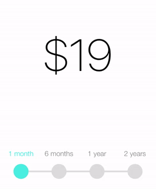
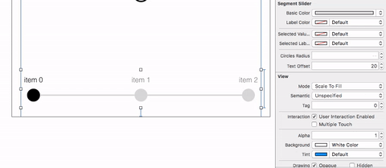

# MMSegmentSlider

[](https://cocoapods.org/pods/MMSegmentSlider)
[](https://github.com/MedvedevMax/MMSegmentSlider/blob/master/LICENSE)

[](https://cocoapods.org/pods/MMSegmentSlider)
[](https://github.com/Carthage/Carthage)

`MMSegmentSlider` is an easy-to-use animated slider for iOS 7+ written in Objective-C.



## Installation

### From CocoaPods

[CocoaPods](http://cocoapods.org) is a dependency manager for Objective-C, which automates and simplifies the process of using 3rd-party libraries like `MMSegmentSlider` in your projects. First, add the following line to your [Podfile](http://guides.cocoapods.org/using/using-cocoapods.html):

```ruby
pod 'MMSegmentSlider'
```

If you want to use the latest features of `MMSegmentSlider` use normal external source dependencies.

```ruby
pod 'MMSegmentSlider', :git => 'https://github.com/MedvedevMax/MMSegmentSlider'
```

This pulls from the `master` branch directly.

Second, install `MMSegmentSlider` into your project:

```ruby
pod install
```

### Carthage 

[Carthage](https://github.com/Carthage/Carthage) is a decentralized dependency manager that builds your dependencies and provides you with binary frameworks.

You can install Carthage with [Homebrew](http://brew.sh/) using the following command:

```bash
$ brew update
$ brew install carthage
```

To integrate `MMSegmentSlider` into your Xcode project using Carthage, specify it in your `Cartfile`:

```ogdl
github "MedvedevMax/MMSegmentSlider"
```

Run `carthage update` to build the framework and drag the built `MMSegmentSlider.framework` (in Carthage/Build/iOS folder) into your Xcode project (Linked Frameworks and Libraries in `Targets`).


### Manually

* Drag the `MMSegmentSlider/MMSegmentSlider` folder into your project.
* Enjoy it

## Usage

(see sample Xcode project in `/demo`)

`MMSegmentSlider` is completely IBInspectable and IBDesignable. That means you can customise it right from the Interface Build and see the changes in the real time.



### Interface Builder

So the simplest way to use MMSegmentSlider is drag & drop the empty view in the Interface Builder and its class to MMSegmentSlider. Then you can customise the appearance right from the attributes inspector.

### Using the code

You can use the following properties to change the look of the slider:

```objective-c
@property (nonatomic, strong) UIColor *basicColor;
@property (nonatomic, strong) UIColor *labelColor;
@property (nonatomic, strong) UIColor *selectedValueColor;
@property (nonatomic, strong) UIColor *selectedLabelColor;
@property (nonatomic) NSInteger circlesRadius;
@property (nonatomic) NSInteger textOffset;
@property (nonatomic, strong) UIFont *labelsFont;
```

Note that font for labels can only be customised from the code:
```objective-c
segmentSlider.labelsFont = [UIFont fontWithName:@"HelveticaNeue-Light" size:14.0f];
```

### Values

To set values for items use:
```objective-c
segmentSlider.values = @[@"$19", @"$99", @"$199", @"$299"];
```
This values will not be visible and will only be returned when you get current value:
```objective-c
priceLabel.text = (NSString *)segmentSlider.currentValue;
```
To set labels for the items use:
```objective-c
segmentSlider.labels = @[@"1 month", @"6 months", @"1 year", @"2 years"];
```
You can also get the index of the current value using the following property:
```objective-c
@property (nonatomic) NSInteger selectedItemIndex;
```

Note that it's not readonly, so you can change current value using it. If you want to animate changing use this method instead:
```objective-c
- (void)setSelectedItemIndex:(NSInteger)selectedItemIndex animated:(BOOL)animated;
```

## License

`MMSegmentSlider` is distributed under the terms and conditions of the [MIT license](https://github.com/MedvedevMax/MMSegmentSlider/blob/master/LICENSE).

## Credits

`MMSegmentSlider` is brought to you by [Max Medvedev](https://twitter.com/max_medvedev). If you're using `MMSegmentSlider` in your project, attribution would be very appreciated.

